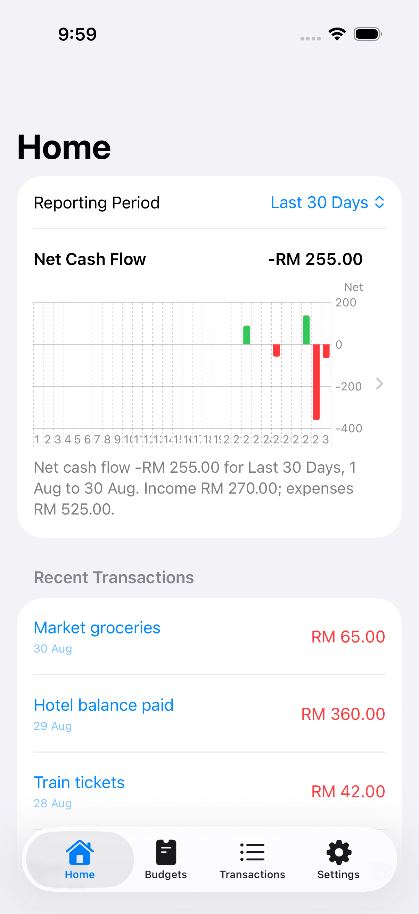
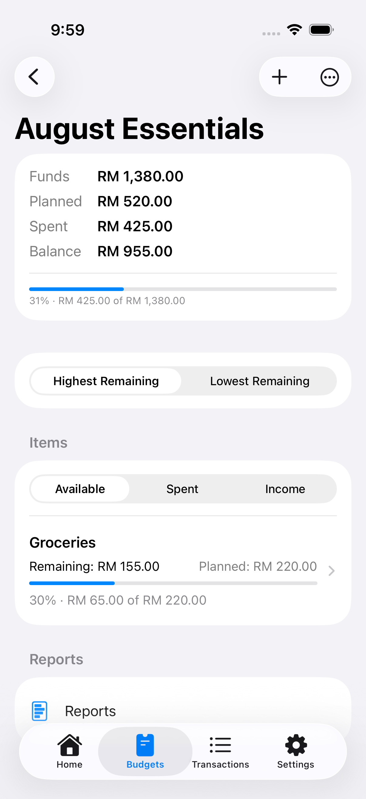
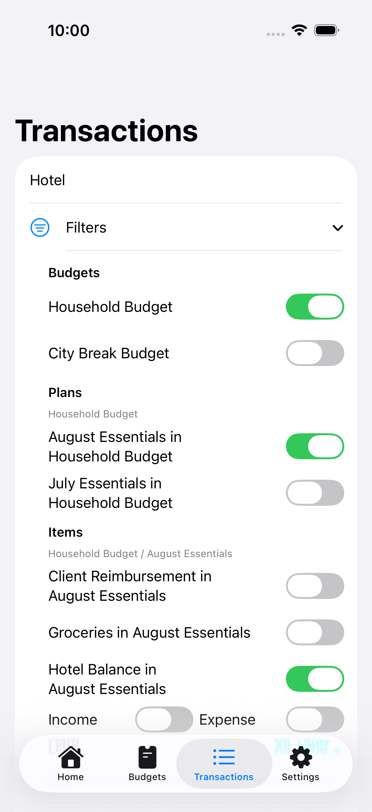
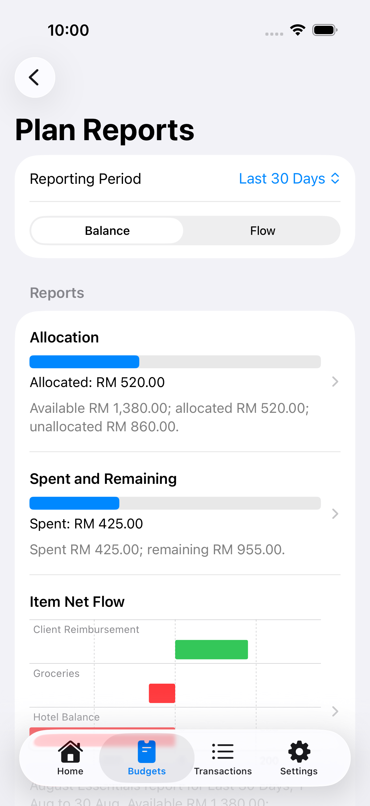
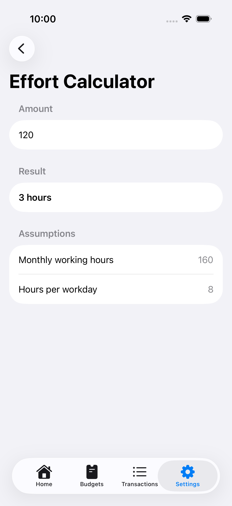
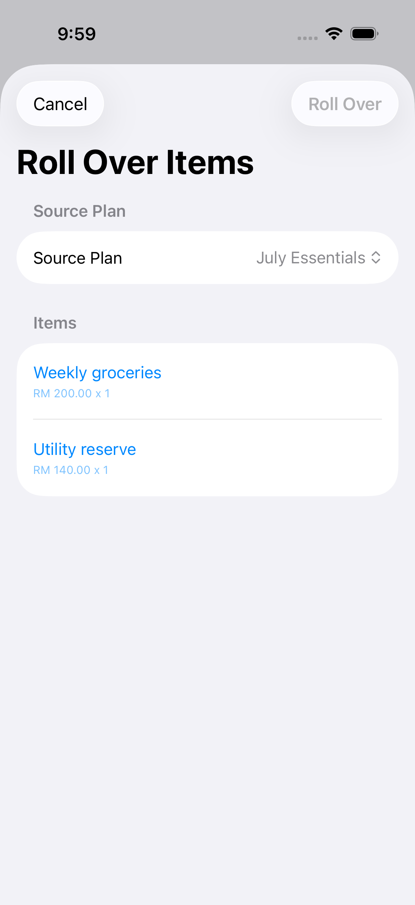
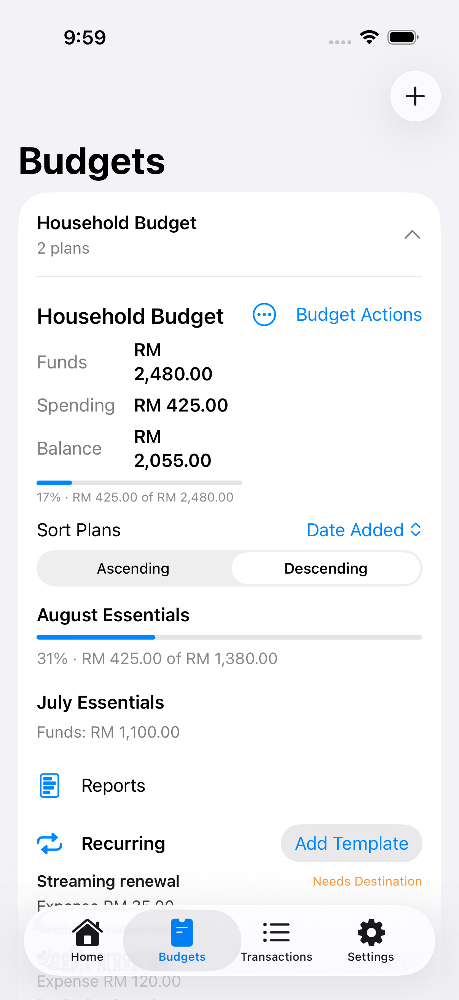

# CanI

CanI is an offline-first personal budgeting app for iPhone. It helps people organize money as **Budgets → Plans → Items → Transactions**, understand where their money is going, and translate prices into the working time needed to earn them.

The app is built with SwiftUI and SwiftData. Financial data stays on the device, calculations use `Decimal`, and no account or cloud service is required.

> [!NOTE]
> CanI is under active development. The current observation build is focused on iPhone 17 in portrait and landscape.

## Screenshots

Screenshots were captured from a deterministic iPhone 17 simulator dataset. See [`docs/screenshots/README.md`](docs/screenshots/README.md) for the capture list and exact filenames.

| Home | Plan items | Transactions |
|:---:|:---:|:---:|
|  |  |  |

| Reports | Time Effort |
|:---:|:---:|
|  |  |

| Rollover | Recurring templates |
|:---:|:---:|
|  |  |

## What it can do

- Organize finances into Budgets, Plans, Items, and Transactions.
- Create, edit, reorder, and safely delete the budgeting hierarchy.
- Separate available, spent or overspent, and income-only Items.
- Record a Transaction and create its Item in the same flow.
- Mark an Item as spent with a single action.
- Preview allocation, remaining funds, and transaction effects before saving.
- Search Transactions by notes, Item name, or Plan name.
- Filter Transactions through a Budget → Plan → Item hierarchy, transaction type, date range, and amount.
- Review Home, Budget, and Plan reports with shared reporting periods and accessible summaries.
- Distinguish effective income from future scheduled income.
- Show current-year dates without repeating the year.
- Roll selected Items from an earlier Plan into a later Plan without copying Transactions.
- Create daily, weekly, monthly, or yearly recurring transaction templates.
- Pause and resume templates, catch up due occurrences, and generate each occurrence exactly once.
- Keep templates when their destination Item is deleted and let the user repair the destination.
- Compare recurring projections separately from actual generated Transactions.
- Hide redundant zero-value metrics and replace empty report charts with a concise empty state.

## Time Effort

Time Effort answers a different budgeting question: **how much working time does this cost?**

Users can securely configure a monthly salary and work schedule, enter an amount in the calculator, or press and hold supported monetary values throughout the app. Salary is stored in Keychain, hidden by default, and hidden again when the app moves to the background.

## Technology

- SwiftUI
- SwiftData
- Swift Charts
- Observation with `@Observable`
- Swift Testing and XCTest UI tests
- Keychain-backed salary storage
- `Decimal` money calculations
- iOS 17.6+

The project uses feature-oriented views with domain calculations, mutation services, persistence, report snapshots, and coordination kept outside the UI layer.

## Run locally

1. Clone the repository.
2. Open `CanIV2.xcodeproj` in Xcode.
3. Select the `CanIV2` scheme.
4. Choose an iPhone simulator running iOS 17.6 or later.
5. Build and run with `⌘R`.

No external package installation or service credentials are required.

## Tests

The current checkpoint contains **167 enabled tests**:

- 118 domain, service, persistence, and coordinator tests
- 49 UI tests

Run the shared `CanIV2.xctestplan` from Xcode. Some end-to-end UI tests are intentionally split into smaller cases to remain within the test runner's per-call time limit.

## Privacy and data

- Budget data is stored locally with SwiftData.
- Monthly salary is stored in Keychain.
- Currency changes relabel values; they do not perform currency conversion.
- Future-dated income is shown separately and does not affect current funds before its date.
- If the persistent store cannot be opened, the app does not silently delete or replace it.

## Project status

Completed work includes the core hierarchy, search and filters, reports, observation refinements, deletion safety, Time Effort, rollover, and recurring transactions.

Planned phases include:

- On-device receipt capture and OCR
- Device-to-device transfer
- Broader device, accessibility, migration, recovery, and release hardening

Phase 4 adds no production model fields: it uses the rollover and recurrence fields already present in the Phase 3 SwiftData schema. An on-disk Phase 3-shaped store reopen test verifies that existing records and relationships survive. Future schema changes must add explicit migration coverage before shipping.

Before release, the project still needs broader device verification and a complete legacy-store migration and startup-recovery failure matrix.

Detailed product and implementation decisions live in [`PRODUCT_SPEC.md`](PRODUCT_SPEC.md), [`UI_SPEC.md`](UI_SPEC.md), and the phase briefs in this repository.

## License

No open-source license has been selected yet. Until a license is added, the source remains under the repository owner's default copyright rights.
